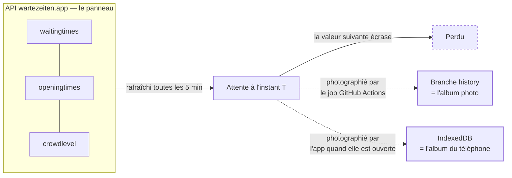
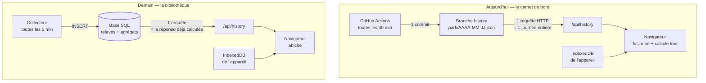
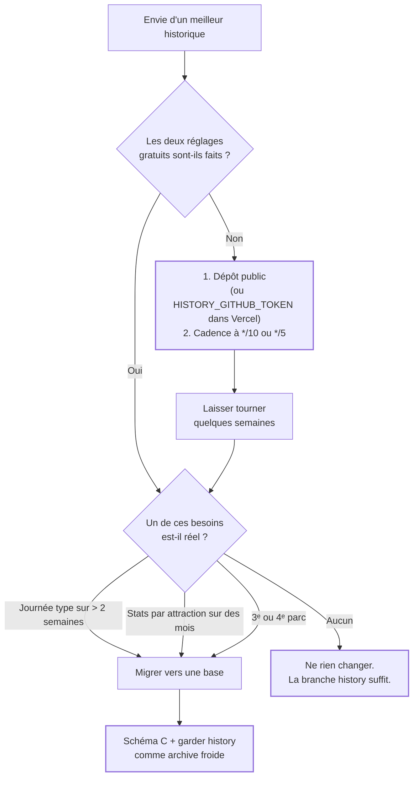

# Historique des files d'attente : ce qu'on peut récupérer, et où le stocker

> Note d'architecture — septembre 2026. Répond à deux questions : peut-on
> récupérer l'historique des parcs suivis, et faut-il passer à une vraie base de
> données (Supabase ou autre) en restant sur des offres gratuites.
>
> **Mise à jour :** l'app suit désormais trois parcs et interroge deux API.
> Walibi Rhône-Alpes est absent des 46 parcs de wartezeiten.app, il passe par
> Queue-Times — voir le README. Cela ne change rien aux conclusions ci-dessous :
> Queue-Times ne publie pas plus d'historique que wartezeiten.app.

---

## En deux phrases

1. **On ne peut pas récupérer le passé.** Aucune API publique ne rend
   l'historique du Parc Astérix ou d'Europa-Park. L'historique commence le jour
   où on se met à l'enregistrer — c'est-à-dire le 2 septembre 2026 pour ce
   projet, et la collecte tourne déjà pour **les deux parcs**.
2. **Il ne faut pas encore migrer.** Mesures à l'appui, la branche `history`
   tient largement le volume. Ce qui coince n'est pas le stockage mais la
   *lecture*. Deux réglages gratuits débloquent bien plus qu'un changement de
   base de données, et se font en cinq minutes.

---

## 1. Pourquoi il n'y a pas d'historique à « récupérer »

L'API wartezeiten.app, c'est **le panneau lumineux à l'entrée du parc**. Il
affiche l'attente maintenant, et quand elle change, l'ancienne valeur est
écrasée. Personne ne garde les vieux panneaux. Pour avoir un historique, il
faut avoir photographié le panneau, régulièrement, soi-même.

### Les sources tierces, une par une

| Source | Historique disponible ? | Utilisable ici ? |
| --- | --- | --- |
| **wartezeiten.app** | Non. Les quatre endpoints (`parks`, `waitingtimes`, `openingtimes`, `crowdlevel`) ne renvoient que l'instant présent. | Déjà utilisée pour le temps réel du Parc Astérix et d'Europa-Park. |
| **queue-times.com** | Oui côté site : une base depuis 2014, avec des pages de stats pour le Parc Astérix (`/parks/9`), Europa-Park (`/parks/51`) et Walibi Rhône-Alpes (`/parks/301`). Mais **l'API gratuite est temps réel uniquement** (`/parks.json`, `/parks/{id}/queue_times.json`). | Utilisée pour le temps réel de Walibi Rhône-Alpes. Pour l'historique : seulement en scrapant les pages de stats — fragile, hors du cadre prévu par leurs conditions, et à recommencer à chaque refonte du site. |
| **thrill-data.com** | Oui, affiche des courbes historiques pour le Parc Astérix. | Même réserve : pas d'API, extraction non prévue. |
| **Jeux de données ouverts** | Il en existe (TouringPlans, DisneylandData…) — mais **uniquement pour les parcs Disney et Universal**. Rien pour les deux parcs européens qui nous intéressent. | Non. |

**Conclusion :** pas de rattrapage possible honnêtement. La bonne nouvelle,
c'est que la couverture est déjà réglée : `scripts/collect-history.mjs` boucle
sur les trois parcs, quelle que soit leur source, et un échec sur l'un ne fait
pas perdre l'instantané des autres.

### Deux réglages gratuits qui changent tout

Ce sont eux, et pas Supabase, qui limitent l'historique aujourd'hui :

**a) Le dépôt est privé — donc l'app ne peut pas relire ce qu'elle collecte.**
Sans jeton, `/api/history` tape sur `raw.githubusercontent.com`, qui répond 404
sur un dépôt privé. Le job accumule consciencieusement des données que l'app ne
voit jamais : l'onglet Historique n'affiche que l'album du téléphone.
→ Soit ajouter `HISTORY_GITHUB_TOKEN` dans Vercel (procédure dans le README),
soit **passer le dépôt en public**.

**b) La cadence est bridée par les minutes Actions.** 28 exécutions/jour à une
minute facturée = 840 des 2 000 minutes/mois offertes sur un dépôt privé. D'où
le relevé toutes les 30 minutes, alors que l'API se rafraîchit toutes les
5 minutes : **on jette 5 mesures sur 6**.
→ Sur un dépôt **public**, les minutes Actions sont illimitées. La même
collecte pourrait passer à `*/10` ou `*/5`, et le jeton devient inutile.

Le dépôt ne contient aucun secret (vérifié : ni `.env`, ni clé, ni jeton en
clair ; le workflow n'utilise que le `GITHUB_TOKEN` éphémère fourni par Actions,
et n'a aucun déclencheur `pull_request_target`). Le passer en public ne coûte
donc rien côté sécurité — c'est même le seul geste qui débloque à la fois la
lecture, la cadence et le jeton.

---

## 2. Faut-il changer de stockage ?

### Ce que la branche `history` sait faire, et ce qu'elle ne sait pas faire

C'est un **carnet de bord relié** : une page par parc et par jour, qu'on ajoute
à la fin. Excellent pour relire *une* journée. Mais pour répondre à « quelle est
l'attente moyenne du Tonnerre de Zeus à 15 h les samedis d'août ? », il faut
rouvrir le carnet page par page et tout relire soi-même.

Une base de données, c'est **une bibliothèque avec un fichier** : on pose la
question, on reçoit la réponse — le tri est fait sur place, pas dans le train du
retour.

### Ce que disent les mesures

J'ai simulé 30 jours de collecte réelle (2 parcs × 28 relevés/jour × 76
attractions, un commit par relevé), puis mesuré le dépôt Git. Le troisième parc
ajoute 27 attractions, soit environ +35 % — les ordres de grandeur tiennent :

| Mesure | Valeur |
| --- | --- |
| Un relevé (41 attractions, Parc Astérix) | ~1,8 ko |
| Le fichier d'une journée, en fin de journée | ~49 ko |
| Objets Git écrits, 30 jours, 2 parcs | 5,4 Mo bruts → **592 ko après `git gc`** |
| **Extrapolation sur un an** | **~7 Mo** |

Git compresse chaque version du fichier du jour par delta avec la précédente,
et elles se ressemblent énormément. **Le stockage n'est donc pas le problème :
la branche tient des décennies.** Ce n'est pas pour ça qu'il faudra migrer.

### Ce qui casse vraiment, dans l'ordre

| # | Limite | Aujourd'hui | Quand ça fait mal |
| --- | --- | --- | --- |
| 1 | **Lecture : 1 requête HTTP par journée** | « Journée type » plafonnée à 7 jours (`useRecentDays`) — c'est déjà un contournement | Vouloir la journée type sur 3 mois = 90 requêtes, ~4,4 Mo téléchargés sur mobile |
| 2 | **Aucune requête possible** | Toute la statistique est calculée dans le navigateur, après téléchargement | « Cette attraction, les samedis, en août » devient inatteignable |
| 3 | **Cadence 30 min** | 840/2 000 min Actions consommées | Ajouter un 3ᵉ parc, ou passer à 5 min, dépasse le quota (dépôt privé) |
| 4 | **Latence** | commit → CDN raw (~5 min) + `revalidate: 300` | Le « direct » n'est pas concerné (il vient de l'API), donc peu grave |

### Les options gratuites, comparées

| | **Supabase** | **Cloudflare D1 + Workers** | **Neon** | **Rester sur Git** |
| --- | --- | --- | --- | --- |
| Stockage offert | 500 Mo | 5 Go (500 Mo/base) | 0,5 Go | illimité de fait |
| Écritures/jour | non plafonnées | 100 000 lignes | non plafonnées | 1 commit/relevé |
| Lectures/jour | 5 Go d'egress/mois | 5 M lignes | 5 Go/mois | CDN GitHub |
| Planificateur inclus | Edge Functions (500 k/mois) | **Cron Triggers, gratuits** | non | GitHub Actions |
| **Piège** | **Projet mis en pause après 7 jours sans activité** (réveil manuel) | Plateforme distincte de Vercel | Auto-suspend, mais **réveil automatique** à la requête | pas de requêtes |
| Bonus | Postgres complet, RLS, dashboard | même plateforme que le collecteur | intégration Vercel native | zéro nouvelle dépendance |

Trois remarques qui comptent plus que le tableau :

- **La pause Supabase n'est pas un problème ici** : un collecteur qui écrit
  toutes les 30 minutes, c'est de l'activité. Le projet ne se mettra jamais en
  pause… *tant que la collecte tourne*. Si tu la coupes une semaine (l'hiver,
  parcs fermés), il faudra réveiller le projet à la main. Neon n'a pas ce
  défaut : il se rendort et se réveille tout seul.
- **Cloudflare D1 est le meilleur candidat technique** : le Cron Trigger
  remplace GitHub Actions *et* ses minutes facturées, et 11 000 lignes écrites
  par jour tiennent largement dans les 100 000 offertes.
- **Aucune de ces bases ne remplace la branche `history`** : garde-la comme
  archive froide. Elle ne coûte rien, elle vit chez un autre hébergeur que la
  base, et elle te rend ta sauvegarde hors-ligne gratuite.

### Comment dimensionner, si on migre

Le choix du schéma pèse bien plus que le choix du fournisseur.

| Schéma | Lignes/an | Poids/an | Requêtable ? |
| --- | --- | --- | --- |
| **A — une ligne par attraction et par relevé**, cadence 5 min | ~4 M | ~400 Mo | Oui, totalement |
| **A′ — idem, cadence 30 min** | ~780 k | ~80 Mo | Oui, totalement |
| **B — un JSONB par relevé** (forme actuelle) | ~20 k | ~36 Mo | Non, pas par attraction |
| **C — A′ conservé 90 jours + table d'agrégats horaires permanente** | ~330 k permanentes | **~35 Mo/an** | Oui, sur toute la profondeur |

**C est le bon schéma** : les relevés bruts servent à la journée en cours et aux
dernières semaines, un job de nuit les replie en moyennes horaires par
attraction, et on purge le brut au-delà de 90 jours. On garde la finesse là où
elle est utile, et l'historique long tient dans 500 Mo pendant plus de dix ans.

---

## 3. Recommandation

**Dans l'ordre :**

1. **Rendre la collecte lisible** — dépôt public, ou `HISTORY_GITHUB_TOKEN` dans
   Vercel. Sans ça, tout le reste est théorique : le job collecte dans le vide.
2. **Monter la cadence** une fois le dépôt public (`*/10`, voire `*/5`).
3. **Laisser vivre.** Avec un jour de données au compteur, migrer maintenant,
   c'est optimiser un problème qu'on n'a pas encore.
4. **Migrer quand un des trois déclencheurs du schéma ci-dessus se produit** —
   pas avant. Cible : Cloudflare D1 si tu acceptes une deuxième plateforme,
   Neon si tu préfères rester dans l'écosystème Vercel, Supabase si le dashboard
   et Postgres complet te tentent. Schéma C dans tous les cas.

---

## 4. Point sécurité

Vérifié aujourd'hui : **aucun secret dans le dépôt** (pas de `.env` suivi, pas de
clé ni de jeton en clair dans les fichiers versionnés), et `HISTORY_GITHUB_TOKEN`
est lu côté serveur uniquement (`src/lib/history/shared.ts` importe
`server-only`, donc une fuite vers le bundle client provoquerait une erreur de
build). Les deux routes API valident leurs paramètres — `isParkId` pour le parc,
une expression régulière `AAAA-MM-JJ` pour la date — avant toute interpolation
dans un chemin, donc pas de traversée de répertoire.

**Le piège à connaître le jour où une base arrive.** Supabase, Neon et D1
distribuent deux clés très différentes :

| Clé | Où elle a le droit d'exister |
| --- | --- |
| `anon` / clé publique | Dans le navigateur, **et seulement si la RLS est active** avec une politique en lecture seule |
| `service_role` / chaîne de connexion | **Jamais** côté client. Variable d'environnement serveur, exclusivement — elle contourne la RLS et donne les pleins pouvoirs sur la base |

Sur Next.js, la règle pratique : tout ce qui est préfixé `NEXT_PUBLIC_` part
dans le bundle envoyé au navigateur. Une clé `service_role` sous ce préfixe est
une compromission totale de la base, publiée sur le CDN. Le plus simple reste de
ne rien exposer du tout : le navigateur parle à `/api/history`, et lui seul
parle à la base.
